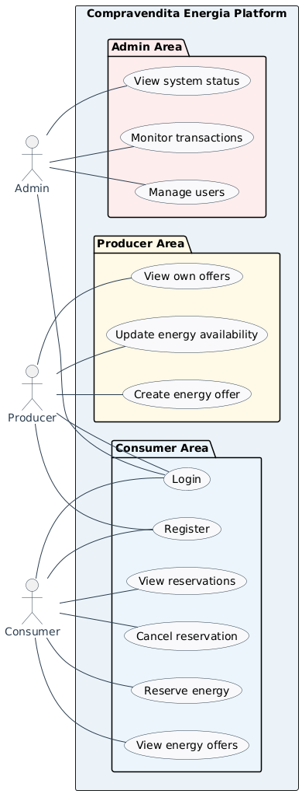
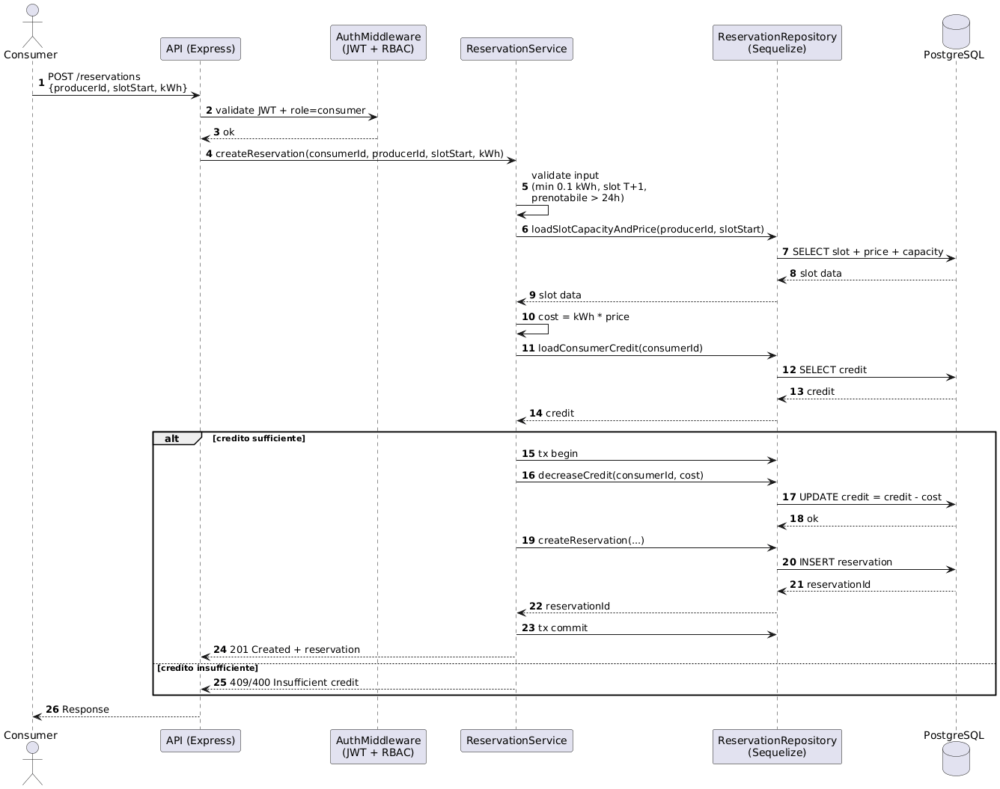
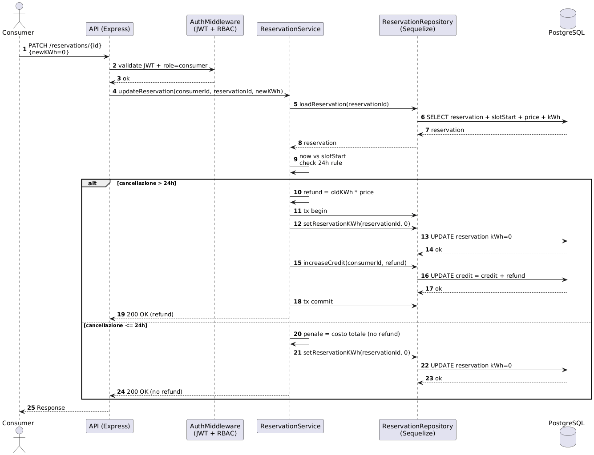

# Compravendita Energia ⚡️

Backend **Node.js + Express + TypeScript + Sequelize + PostgreSQL** per la **compravendita di energia** su slot orari (T+1: si compra oggi per consumare domani).

---

## Indice
- [Descrizione](#descrizione)
- [Requisiti](#requisiti)
- [Regole di dominio](#regole-di-dominio)
- [Stack](#stack)
- [Struttura repository](#struttura-repository)
- [Avvio rapido (Docker)](#avvio-rapido-docker)
- [Avvio in dev (opzionale)](#avvio-in-dev-opzionale)
- [Test](#test)
- [Postman & Newman](#postman--newman)
- [UML & Design Pattern](#uml--design-pattern)
- [Roadmap](#roadmap)
- [Autori](#autori)

---

## Descrizione
Il sistema gestisce:
- **Produttori** con capacità e prezzo per kWh (anche variabili per ora).
- **Consumatori** con credito/token per acquistare energia.
- **Prenotazioni** su slot da **1 ora** per il giorno successivo (**T+1**).
- **Modifiche/cancellazioni** con regole temporali.
- **Statistiche** (venduto/occupazione/guadagni) e **carbon footprint**.

> Nota: questo repository contiene il **backend**. L’obiettivo è rispettare i requisiti della consegna (JWT+ruoli, validazioni, middleware, test, docker-compose, Postman/Newman, UML, pattern).

---

## Requisiti
- Node.js + Express
- Sequelize + DB esterno (PostgreSQL)
- TypeScript
- JWT con ruolo (`admin | producer | consumer`)
- Validazione input, middleware, error handler
- ≥ 6 test con Jest
- Docker Compose per avvio, Postman/Newman per test, README con UML + pattern

---

## Regole di dominio
- Slot acquistabili rispettando la regola delle **24 ore** rispetto all’inizio dello slot.
- Quantità minima acquistabile: **0.1 kWh**.
- Se richieste > capacità oraria → **taglio proporzionale** (lineare), con accettazione a discrezione del produttore.
- Modifica/cancellazione:
  - **> 24h**: nessun costo
  - **≤ 24h**: addebito totale

---

## Stack
- **Express 5** + **TypeScript**
- **PostgreSQL 16** (container)
- **Sequelize** (ORM)
- **Zod** (validation)
- **Jest + Supertest** (test API)
- **Postman + Newman** (run CLI collezioni)
- **Docker Compose** (orchestrazione)

---

## Struttura repository
```text
.
├─ docker-compose.yaml
├─ Dockerfile
├─ .env
├─ package.json
├─ tsconfig.json
└─ src
   ├─ app.ts
   ├─ server.ts
   ├─ config
   │  ├─ env.ts
   │  └─ db.ts
   ├─ routes
   │  └─ health.routes.ts
   ├─ middlewares
   │  └─ errorHandler.ts
   └─ tests
      └─ health.test.ts
```

---

## Avvio rapido (Docker)

### 1) Configura `.env`
Esempio:
```env
PORT=3000
DB_HOST=db
DB_PORT=5432
DB_NAME=energy
DB_USER=app
DB_PASSWORD=app
JWT_SECRET=change_me
```

### 2) Avvia stack
> In questo repo il file Compose si chiama `docker-compose.yaml`. Per evitare ambiguità usiamo `-f`.

```bash
docker compose -f docker-compose.yaml up --build
```

### 3) Smoke test
```bash
curl -i http://localhost:3000/health
```
Output atteso: `200 OK` con `{"status":"ok"}`.

---

## Avvio in dev (opzionale)
Se vuoi avviare senza Docker:
```bash
npm install
npm run dev
```

---

## Test
Esecuzione:
```bash
npm test
```

---

## Postman & Newman

Questa repo include una **collection Postman minimale** per dimostrare che l’API è testabile in automatico con **Newman** (requisito esplicito).

### Struttura
```text
postman/
  CompravenditaEnergia.postman_collection.json
  CompravenditaEnergia.postman_environment.json
```

### Endpoint coperti dalla collection
- `GET /health` → deve rispondere `200`
- `POST /auth/login` → **stub**: accetta credenziali e ritorna `{ "token": "<JWT>" }`
- `GET /protected/ping` → **protetto**: richiede `Authorization: Bearer <JWT>` e risponde `200`

> Nota: la collection di default usa `username=admin` e `password=admin`.  
> Se cambiate le credenziali, aggiornate **o** la collection **o** le variabili d’ambiente nel container.

### Installazione Newman (consigliata: locale al progetto)
```bash
npm i -D newman
```

### Esecuzione test (con npx)
```bash
npx newman run postman/CompravenditaEnergia.postman_collection.json \
  -e postman/CompravenditaEnergia.postman_environment.json
```

### Output atteso (esempio reale)
Alla fine dovreste vedere **0 failed** e tutte le assertion verdi, ad esempio:
- login `200` + token salvato in `env.jwt`
- chiamata protetta `200` con `Bearer {{jwt}}`

### Troubleshooting (le 3 cause tipiche)
1. **401 su /auth/login** → credenziali sbagliate o env non caricate nel container (`ADMIN_USER`, `ADMIN_PASS`).
2. **401 su /protected/ping** → token non salvato (login fallito) o `JWT_SECRET` diverso tra generazione e verify.
3. **404 sulle route** → avete montato male i router o avete messo l’`errorHandler` prima delle route (in Express l’ordine conta).

---
## UML & Design Pattern

### UML (in `docs/uml/`)
### Use Case Diagram
Il diagramma dei casi d’uso descrive gli attori del sistema (Admin, Producer, Consumer) e le principali funzionalità offerte dalla piattaforma.



### Sequence Diagram – Reservation
Mostra il flusso di prenotazione dell’energia, inclusa la validazione del token e la scalatura del credito.



### Sequence Diagram – Cancellation
Descrive il processo di cancellazione di una prenotazione con eventuale rimborso o applicazione di penali.



### Design Pattern (minimo sensato)
- **Service Layer**: logica business fuori dalle route
- **Repository**: accesso DB isolato dai service
- **Strategy**: algoritmo di allocazione/taglio intercambiabile (es. `ProportionalCutStrategy`)

---

## Roadmap
- [x] Scaffold + Healthcheck
- [ ] Migrations + modelli DB (`User`, `ProducerSlot`, `Reservation`, …)
- [ ] Auth JWT + RBAC
- [ ] Endpoint Producer (slot, richieste, resolve, stats, earnings)
- [ ] Endpoint Consumer (prenota, modifica/cancella, acquisti filtrati, carbon footprint)
- [ ] ≥ 6 test Jest
- [ ] Postman collection + Newman run
- [ ] UML + pattern finalizzati nel README

---

## Autori
- **Nicolò Ianni**
- **Danilo La Palombara**
