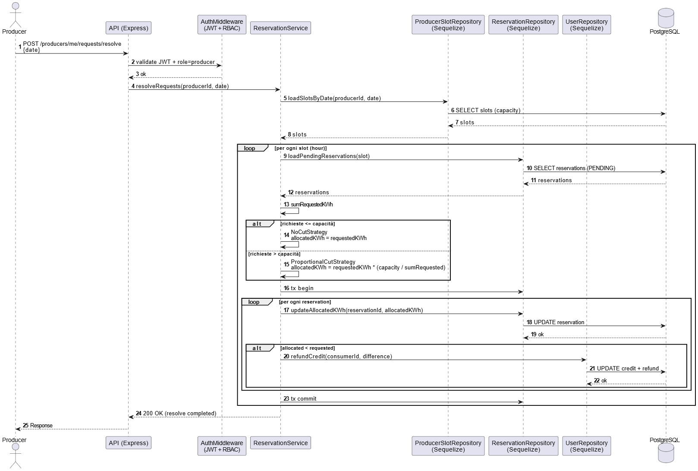
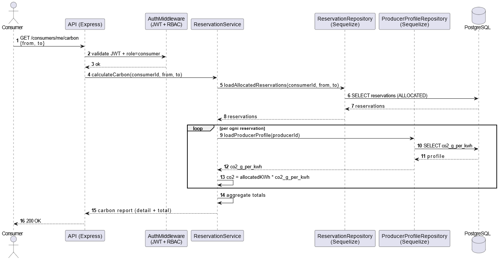

# Compravendita Energia ⚡️

---

## Indice
- [Obiettivo del progetto](#obiettivo-del-progetto)
- [Requisiti](#requisiti)
- [Regole di dominio](#regole-di-dominio)
- [Stack](#stack)
- [Struttura repository](#struttura-repository)
- [API](#api)
- [Configurazione](#configurazione)
- [Avvio rapido (Docker)](#avvio-rapido-docker)
- [Test](#test)
- [Postman & Newman](#postman--newman)
- [UML](#uml)
- [Design Pattern](#design-pattern)
- [Autori](#autori)

---

## Obiettivo del progetto
L’obiettivo è realizzare un’applicazione che:

- Gestisce utenti con ruoli (**admin / producer / consumer**)
- Consente ai produttori di definire per ogni ora **capacità (kWh)** e **prezzo (credit/kWh)**
- Consente ai consumatori di creare **prenotazioni di energia**
- Gestisce il **credito** dei consumatori con addebiti atomici (transaction DB)
- Gestisce concorrenza e consistenza in presenza di richieste simultanee
- Produce **statistiche** su occupazione, vendite, ricavi e **carbon footprint**

Le prenotazioni dei consumatori **non vengono risolte automaticamente**:  
ogni prenotazione nasce in stato **PENDING** e sarà successivamente gestita dal producer
(taglio proporzionale, allocazione, rimborsi).

L’applicazione è progettata come **API REST**, con particolare attenzione a:
- autenticazione e autorizzazione (JWT)
- regole di dominio esplicite
- verificabilità del comportamento tramite test automatici

---

## Requisiti

### 1. Ruoli
- **Admin**: crea produttori e consumatori (seed o endpoint dedicato).
- **Producer**: gestisce slot (capacità/prezzo), vede richieste, risolve allocazioni, consulta statistiche/ricavi.
- **Consumer**: prenota/modifica/cancella, vede acquisti e impronta CO₂.

### 2. “Oggi per domani”
Per semplicità operativa, il sistema lavora su **slot del giorno successivo (domani)**.

### 3. Slot orario
Ogni slot è identificato da:
- `date` (YYYY-MM-DD)
- `hour` (0–23)

### 4. Credito
- il consumer ha un saldo **credit**
- la prenotazione **scala** il credito (in transaction)
- cancellazioni/modifiche possono generare **rimborsi** in base alle regole

### 5. Taglio proporzionale (oversubscription)
Se la somma richiesta supera la capacità:
- il producer applica un **taglio lineare proporzionale**
- l’allocato può essere < richiesto → si rimborsa la differenza

### 6. Carbon footprint
Il sistema calcola CO₂ come:
- `kWh * co2_g_per_kwh` (in grammi)

---

## Regole di dominio

- **Oggi per domani**
  - Il sistema lavora su slot del **giorno successivo** (domani).
  - Ogni slot è identificato da:
    - `date` (YYYY-MM-DD)
    - `hour` (0–23)

- **Vincolo 24h (prenotazione / modifica / cancellazione)**
  - Uno slot è prenotabile **solo se l’inizio dello slot è strettamente oltre 24 ore rispetto al momento attuale**:
    - Implementazione: `slotStart > now + 24h`
  - Modifica/cancellazione:
    - **oltre 24h** → possibili rimborsi (dove previsti)
    - **entro 24h** → **NO refund** (l’addebito resta)

- **Creazione prenotazione (consumer)**
  - La prenotazione viene creata solo se:
    - lo slot esiste (`SLOT_NOT_FOUND` se non esiste)
    - mancano almeno **24h** all’inizio dello slot (`SLOT_NOT_BOOKABLE_24H`)
    - il consumer ha credito sufficiente (`INSUFFICIENT_CREDIT`)
    - `requestedKwh` è valido (minimo `>= 0.1`)
  - Se la prenotazione va a buon fine:
    - viene scalato il credito in modo consistente
    - la prenotazione viene salvata in stato **`PENDING`**

- **Modifica / cancellazione prenotazione (consumer)**
  - L’operazione è soggetta al vincolo **24h**:
    - **oltre 24h** → se la quantità diminuisce o viene annullata → rimborso della differenza (coerente col credito)
    - **entro 24h** → **NO refund** (addebito invariato)

- **Resolve producer (allocazione energia)**
  - Le prenotazioni nascono **`PENDING`** e vengono chiuse solo con l’azione del producer (`resolve`).
  - In fase di resolve, per ogni `date` + `hour`:
    - si calcola `sumRequestedKwh` (somma delle richieste PENDING)
    - si confronta con `capacityKwh`
  - Se `sumRequestedKwh <= capacityKwh`:
    - strategia **NoCut** → `allocatedKwh = requestedKwh`
  - Se `sumRequestedKwh > capacityKwh`:
    - strategia **ProportionalCut** → `allocatedKwh = requestedKwh * (capacityKwh / sumRequestedKwh)`
  - Al termine:
    - le prenotazioni vengono aggiornate con `allocatedKwh`
    - lo stato viene chiuso (es. **`ALLOCATED`**)

- **Rimborso differenze post-resolve**
  - Se dopo resolve `allocatedKwh < requestedKwh`:
    - `refund = (requestedKwh - allocatedKwh) * pricePerKwh`

- **Carbon footprint (CO₂)**
  - La CO₂ viene calcolata sull’energia effettiva allocata:
    - `co2_g = allocatedKwh * co2_g_per_kwh`
  - Output:
    - dettaglio per slot acquistato
    - totale su intervallo (anche in kg)

- **Earnings producer**
  - Ricavi calcolati sugli acquisti effettivi:
    - somma di `allocatedKwh * pricePerKwh` (o campo equivalente “charged”)

- **Stats producer (% venduta per fascia oraria)** DA MODIFICARE
  - Per ogni ora (0–23) su un intervallo di date:
    - `%sold = (kWh allocati / capacityKwh) * 100`
  - Output per fascia oraria:
    - `min`, `max`, `avg`, `std`
    - 
---

## Stack
- **Node.js + Express** (API)
- **TypeScript** (tipi, meno errori idioti)
- **Sequelize** (ORM)
- **PostgreSQL** (DB) via **Docker Compose**
- **Jest + Supertest** (test API)
- **Postman** (test manuale + definizione collection)
- **Newman** (esecuzione Postman da CLI, ripetibile, “come un test”)

---

## Struttura repository DA AGGIORNARE, SERVE?
```text
.
├─ docker-compose.yaml
├─ Dockerfile
├─ .env
├─ package.json
├─ tsconfig.json
├─ postman
│  ├─ CompravenditaEnergia.postman_collection.json
│  └─ CompravenditaEnergia.postman_environment.json
├─ docs
│  └─ uml
│     └─ img
│        ├─ use-case.png
│        ├─ reservation.png
│        └─ Sequence-cancel.png
└─ src
   ├─ app.ts
   ├─ server.ts
   ├─ config
   │  ├─ env.ts
   │  └─ db.ts
   ├─ middlewares
   │  ├─ auth.ts
   │  └─ errorHandler.ts
   ├─ routes
   │  ├─ health.routes.ts
   │  ├─ auth.routes.ts
   │  └─ protected.routes.ts
   ├─ services
   │  └─ producerSlotService.ts
   ├─ repositories
   │  └─ producerSlotRepository.ts
   ├─ controller
   │  └─ producerSlotsController.ts
   ├─ seed
   │  └─ seed.ts
   └─ tests
      ├─ health.test.ts
      ├─ producerSlots.capacity.test.ts
      └─ producerSlots.price.test.ts
```
---

## API

Questa sezione descrive gli endpoint relativi alla gestione della **capacità** e del **prezzo** degli slot energetici per i produttori, e l’endpoint di **prenotazione** per i consumer. Sono illustrate le rotte disponibili, i requisiti di autenticazione/autorizzazione, le regole di validazione e il comportamento generale dei controller.

### Rotte
Di seguito un riepilogo delle rotte principali implementate nel progetto:

| Metodo | Percorso | Descrizione |
|--------|----------|-------------|
| `POST`  | `/auth/login` | Login utente e generazione JWT |
| `GET`   | `/health` | Healthcheck dell’API |
| `GET`   | `/protected/ping` | Endpoint protetto di verifica JWT |
| `PATCH` | `/producers/me/slots/capacity` | DA AGGIORNARE CON PRICE + CAPACITY |
| `GET`   | `/producers/me/requests` | Overview richieste per fascia oraria e % occupazione (filtrabile) |
| `POST`  | `/producers/me/requests/resolve` | Risolve le richieste dei consumatori (allocazione, taglio proporzionale, rimborsi) |
| `GET`   | `/producers/me/stats` | Statistiche DA AGGIORNARE |
| `GET`   | `/producers/me/earnings` | Guadagni del produttore su intervallo temporale |
| `POST`  | `/consumers/me/reservations` | Crea prenotazione di uno slot (stato iniziale `PENDING`) |
| `PATCH` | `/consumers/me/reservations/:id` | Modifica quantità o cancella (regola 24h + refund/penale) | DA VEDERE
| `GET`   | `/consumers/me/purchases` | Lista acquisti filtrabile per produttore, tipo di energia ed intervallo temporale |
| `GET`   | `/consumers/me/carbon` | Calcolo impronta di carbonio su intervallo temporale (dettaglio + totale) |


### Comportamento dei controller

I controller relativi alle rotte sopra seguono queste regole:

- **Autenticazione JWT obbligatoria (rotte protette)**
  - Il token deve essere inviato nell’header `Authorization: Bearer <token>`
  - Se manca o è invalido → `401 Unauthorized`

- **Autorizzazione per ruolo**
  - Solo utenti con `role: "producer"` possono aggiornare slot capacity/price
  - Solo utenti con `role: "consumer"` possono creare prenotazioni
  - Caso negativo → `403 Forbidden`

- **Validazione dei dati (slot producer)**
  - Per ogni slot passato nel body vengono verificati:
    - `date` presente e formato valido (`YYYY-MM-DD`)
    - `hour` tra 0 e 23
    - `capacityKwh` >= 0 (per capacity)
    - `pricePerKwh` >= 0 (per price)
  - In caso di input non valido → `400 Bad Request` con messaggio esplicativo

- **Transazioni atomiche (slot producer)**
  - Tutti gli aggiornamenti vengono eseguiti in una transazione
  - Se anche un singolo elemento è invalido, **nessuna modifica viene applicata**

---

## Configurazione

Il progetto utilizza variabili d’ambiente per configurare l’API, la connessione al database
e il sistema di autenticazione JWT.

Le variabili vengono lette:
- in **Docker Compose** (servizio `api`) tramite i file indicati nella configurazione di Compose (`.env`);
- in **esecuzione locale (dev)** tramite il file `.env`.

### Variabili richieste

#### API
- `PORT`: porta su cui viene esposta l’API Express.  
  Esempio: `3000`.

- `JWT_SECRET`: segreto utilizzato per firmare e verificare i token JWT.  
  **Obbligatoria**: se mancante, le rotte protette falliscono l’autenticazione.

#### Database (PostgreSQL)
- `DB_HOST`: host del database  
  - in Docker: tipicamente `db`  
  - in locale: tipicamente `localhost`

- `DB_PORT`: porta del database PostgreSQL (default `5432`)

- `DB_NAME`: nome del database (es. `energy`)

- `DB_USER`: utente del database (es. `app`)

- `DB_PASS`: password del database (es. `app` in ambiente di sviluppo)

---

## Avvio rapido (Docker)

### 1) Avvia i servizi
Avvia l’API e il database PostgreSQL tramite Docker Compose:
```bash
docker compose up --build
```

### 2) Esegui le migration
Crea tutte le tabelle necessarie nel database:
```bash
docker compose exec api npx sequelize-cli db:migrate
```

### 3) Popola il database con dati di test (seed)
Inserisce utenti e dati minimi utili per test manuali e dimostrazioni:
```bash
docker compose exec api npx sequelize-cli db:seed:all
```
Il seed crea utenti base (admin / producer / consumer) con password hashate (bcrypt).

### 4) Verifica funzionamento (healthcheck)
```bash
curl -i http://localhost:3000/health
```
Risposta attesa: 200 OK.

#### Troubleshooting rapido
- Errori di connessione al database → verificare le variabili d’ambiente (DB_HOST, DB_NAME, DB_USER, DB_PASS).
- Database in stato incoerente → ripartire da zero rimuovendo anche i volumi:
```bash
docker compose down -v
docker compose up --build
```

---

## Test DA MODIFICARE
I test automatici verificano che l’API risponda correttamente sugli endpoint principali e che le **regole di dominio** siano applicate in modo consistente. Sono scritti con **Jest** e **Supertest** e vengono eseguiti contro l’API Express, con database reale (PostgreSQL) avviato tramite Docker.

Esecuzione:
```bash
npm test
```
Nota operativa: eseguendo npm test, ad ogni run avviene il reset completo del database e poi vengono eseguite automaticamente le migration e la seed (inizializzazione), così da garantire uno stato coerente e ripetibile ad ogni esecuzione della suite.

La suite di test automatici copre i principali flussi dell’applicazione, includendo autenticazione, gestione slot, prenotazioni, regole 24h, allocazioni proporzionali e rimborsi.

Di seguito alcuni esempi rappresentativi:

#### 1. 🟢 Test – Capacity aggiornata correttamente

Questo test verifica che l’endpoint di aggiornamento della capacity accetti un input valido e ritorni lo stato 200 OK, con conferma di successo.
Assicura inoltre che il producer autenticato possa aggiornare correttamente la capacità dell’orario specificato.

**Endpoint**: PATCH /producers/me/slots/capacity

**Headers**: Authorization: Bearer <JWT>, Content-Type: application/json

**Body**:
```json
[
  { "date": "2026-01-20", "hour": 10, "capacityKwh": 50 }
]
```
Expected Response: HTTP/1.1 200 OK
```json
[
  { "success": true }
]
```

#### 2. 🔴 Test – Price non valido: hour fuori range
Questo test verifica che l’endpoint price rifiuti correttamente un valore di hour fuori dal range accettato (0–23).
Il server ritorna 400 Bad Request con messaggio di errore esplicativo.

**Endpoint**: PATCH /producers/me/slots/capacity

**Headers**: Authorization: Bearer <JWT>, Content-Type: application/json

**Body**:
```json
[
  { "date": "2026-03-10", "hour": 25, "pricePerKwh": 20 }
]
```
Expected Response: HTTP/1.1 400 Bad Request
```json
[
  { "error": "hour deve essere tra 0 e 23" }
]
```

#### 3. 🔴 Test – Ruolo non autorizzato (non producer)
Questo test verifica che un utente autenticato con ruolo diverso da producer
non possa aggiornare capacity/price e riceva 403 Forbidden.

**Endpoint**: PATCH /producers/me/slots/price

**Headers**: Authorization: Bearer <JWT (ruolo non producer)>, Content-Type: application/json

**Body**:
```json
[
  { "date": "2026-03-10", "hour": 14, "pricePerKwh": 30 }
]
```
Expected Response: HTTP/1.1 403 Forbidden
```json
[
  { "error": "Accesso non consentito" }
]
```
---

## Postman & Newman

### Postman
Postman è utilizzato per testare manualmente gli endpoint dell’API durante lo sviluppo,
verificando rapidamente il comportamento delle rotte protette, delle validazioni
e delle regole di dominio.

Nel progetto viene usato per:
- testare il flusso di autenticazione JWT
- verificare le rotte producer (capacity / price)
- testare la creazione di prenotazioni lato consumer
- salvare richieste in una **Collection** riutilizzabile

Le richieste sono organizzate in una collection dedicata, con uso di variabili
d’ambiente per:
- base URL
- credenziali di test
- token JWT (salvato automaticamente dopo il login)

#### Installazione Postman
Su sistemi Linux (Ubuntu/Debian), Postman può essere installato tramite **Snap**:
```bash
sudo snap install postman
```
Una volta installato, importare i file forniti nel progetto:
- postman/CompravenditaEnergia.postman_collection.json
- postman/CompravenditaEnergia.postman_environment.json

### Newman
Newman è l’esecuzione **da linea di comando** delle collection Postman.
Permette di rendere i test API:
- ripetibili
- automatizzabili
- verificabili senza interfaccia grafica

È particolarmente utile in fase di consegna, perché consente di dimostrare
il corretto funzionamento dell’API in modo oggettivo.

### Installazione Newman (consigliata: locale al progetto)
```bash
npm i -D newman
```

### Alcuni Endpoint coperti dalla collection
- `GET /health` → `200 OK`
- `POST /auth/login` → `200 OK` e ritorna `{ "accessToken": "<JWT>" }` con credenziali valide
- `POST /auth/login` (wrong password) → `401 Unauthorized`
- `GET /protected/ping` (con token) → `200 OK`
- `PATCH /producers/me/slots/capacity` (producer + body valido) → `200 OK`
- `PATCH /producers/me/slots/price` (validazione fallita) → `400 Bad Request`
- `POST /consumers/me/reservations` (consumer + richiesta valida) → `201 Created` (prenotazione in stato `PENDING`)

> Nota: la collection usa variabili d’ambiente Postman (`admin_email`, `admin_password`) e salva automaticamente il token in `jwt_token` (e per compatibilità anche in `jwt`).  
> Se cambiano le credenziali di seed è necessario aggiornare le variabili nell’environment Postman.  
> Per le rotte protette, la collection usa `Authorization: Bearer {{jwt_token}}`.


###OUTPUT ATTESO DA METTERE???
La suite Newman deve completarsi senza errori (0 failed), confermando:
- API raggiungibile (`/health`)
- login valido produce un token JWT
- casi negativi (`400/401`) gestiti correttamente
- endpoint protetto accessibile solo con Bearer token valido

### Troubleshooting (le 3 cause tipiche)
1. **401 su /auth/login** → credenziali non valide (variabili Postman `admin_email`, `admin_password`) oppure utenti di test non inizializzati tramite seed.
2. **401 su /protected/ping** → token non salvato (login fallito) o `JWT_SECRET` diverso tra generazione e verify.
3. **404 sulle route** → avete montato male i router o avete messo l’`errorHandler` prima delle route (in Express l’ordine conta).

---

## UML

### Use Case Diagram
Il diagramma dei casi d’uso descrive gli attori del sistema (**Admin**, **Producer**, **Consumer**)
e le principali funzionalità offerte dalla piattaforma.

In particolare:
- il **Producer** gestisce capacità e prezzo degli slot orari;
- il **Consumer** può creare prenotazioni di energia soggette a vincoli temporali;
- l’**Admin** inizializza il sistema (seed / creazione utenti).


### Sequence Diagram – Reservation
Il diagramma di sequenza mostra il flusso completo di **creazione di una prenotazione** lato consumer.

Sono evidenziati:
- verifica del JWT e del ruolo `consumer`;
- controllo della regola delle **24h**;
- recupero dello slot del producer;
- verifica del credito disponibile;
- creazione della prenotazione in stato **`PENDING`**;
- scalatura del credito del consumer.

L’intero flusso avviene all’interno di una **transaction**, per garantire consistenza
anche in presenza di richieste concorrenti.


### Sequence Diagram – Cancellation
Il diagramma descrive il processo di cancellazione di una prenotazione,
inclusa la valutazione della finestra temporale e l’eventuale rimborso.


### Sequence Diagram - Resolve
Il diagramma di sequenza descrive il processo con cui il producer risolve le prenotazioni
in stato PENDING per una determinata data, applicando se necessario il taglio proporzionale
in caso di oversubscription.

Sono evidenziati:

- verifica del JWT e del ruolo producer;
- recupero degli slot orari e delle prenotazioni pendenti;
- calcolo della domanda totale per ciascuna fascia oraria;
- selezione della strategia di allocazione (NoCut / ProportionalCut);
- aggiornamento delle prenotazioni con il valore di allocatedKwh;
- rimborso delle differenze economiche ai consumer, quando l’allocato è inferiore al richiesto.




### Sequence Diagram - Carbon
Il diagramma di sequenza descrive il calcolo dell’impronta di carbonio (CO₂) lato consumer,
basato esclusivamente sull’energia effettivamente allocata a seguito del processo di resolve.



---

## Design Pattern

L’architettura del progetto è progettata per separare chiaramente le responsabilità
tra i vari livelli dell’applicazione, riducendo il coupling e rendendo il codice
più testabile, manutenibile ed estendibile.

### Repository Pattern

Il **Repository Pattern** è utilizzato per isolare l’accesso al database
dalla logica di business, incapsulando l’uso diretto di Sequelize.

Ogni repository espone metodi specifici per il dominio applicativo
(es. recupero slot, creazione prenotazioni, aggiornamento credito),
nascondendo i dettagli dell’ORM ai livelli superiori.

Questo approccio:
- riduce il coupling con Sequelize;
- rende i service più semplici da testare;
- centralizza l’accesso ai dati.

Esempi nel progetto:
- `UserRepository`
- `ProducerSlotRepository`
- `ReservationRepository`

### Service Layer

Il **Service Layer** incapsula la logica di business e le **regole di dominio**
dell’applicazione.

In particolare, i service:
- validano input e condizioni di dominio;
- coordinano più repository;
- gestiscono le **transaction** Sequelize;
- sollevano errori di dominio significativi.

Esempi nel progetto:
- `ProducerSlotService` (gestione capacity / price)
- `ReservationService` (creazione prenotazioni consumer)

Questo consente ai controller di rimanere sottili (*thin controllers*),
limitandosi a:
- leggere la richiesta HTTP;
- delegare al service;
- restituire la risposta.

### Middleware Pattern

Il **Middleware Pattern** è utilizzato per gestire funzionalità trasversali
alle API, in particolare:

- autenticazione JWT;
- autorizzazione basata sul ruolo;
- gestione centralizzata degli errori.

I middleware intercettano le richieste dirette agli endpoint protetti,
verificano la presenza e la validità del token, e arricchiscono la request
con le informazioni dell’utente autenticato.

Questo evita duplicazioni di codice e mantiene separata la logica di sicurezza
dalla logica applicativa.

### Strategy Pattern

Lo Strategy Pattern è utilizzato per gestire in modo flessibile le politiche
di allocazione dell’energia durante la fase di resolve delle prenotazioni
lato producer.

In base al rapporto tra domanda totale e capacità disponibile dello slot,
il sistema seleziona dinamicamente la strategia di allocazione più appropriata.

In particolare sono implementate:

- NoCutStrategy
  - applicata quando la somma delle richieste è minore o uguale alla capacità;
  - ogni prenotazione riceve allocatedKwh = requestedKwh.

- ProportionalCutStrategy
  - applicata in caso di oversubscription (richieste > capacità);
  - l’energia viene allocata tramite taglio lineare proporzionale:
    - allocatedKwh = requestedKwh * (capacity / sumRequested).

---

## Autori
- **Nicolò Ianni**
- **Danilo La Palombara**
