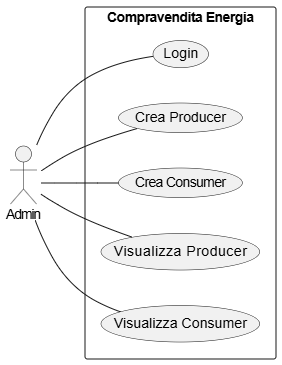
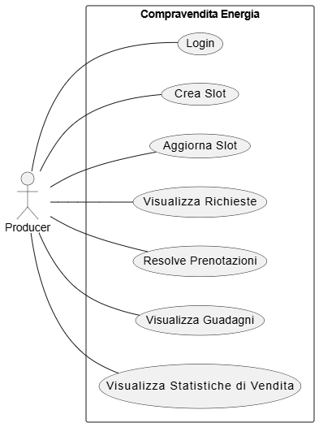

# Compravendita Energia ⚡️

---

## Indice
- [Obiettivo del progetto](#obiettivo-del-progetto)
- [Requisiti](#requisiti)
- [Regole di dominio](#regole-di-dominio)
- [Stack](#stack)
- [API](#api)
- [Configurazione](#configurazione)
- [Avvio rapido (Docker)](#avvio-rapido-docker)
- [Test](#test)
- [Postman & Newman](#postman--newman)
- [UML](#uml)
- [Design Pattern](#design-pattern)
- [Autori](#autori)

---

## Obiettivo del progetto
L’obiettivo è realizzare un’applicazione che:

- Gestisce utenti con ruoli (**admin / producer / consumer**)
- Consente ai produttori di definire per ogni slot, ora **capacità (kWh)** e **prezzo (price/kWh)**
- Consente ai consumatori di creare **prenotazioni degli slot **
- Gestisce il **credito** dei consumatori con addebiti atomici (transaction DB)
- Gestisce concorrenza e consistenza in presenza di richieste simultanee
- Produce **statistiche** su occupazione, vendite, ricavi e **carbon footprint**

Le prenotazioni dei consumatori **non vengono risolte automaticamente**:  
ogni prenotazione nasce in stato **PENDING** e sarà successivamente gestita dal producer
(taglio proporzionale, allocazione, rimborsi).

L’applicazione è progettata come **API REST**, con particolare attenzione a:
- autenticazione e autorizzazione (JWT)
- regole di dominio esplicite
- verificabilità del comportamento tramite test automatici

---

## Requisiti

### 1. Ruoli
- **Admin**: crea produttori e consumatori.
- **Producer**: gestisce slot (capacità/prezzo), vede richieste, risolve allocazioni, consulta statistiche/ricavi.
- **Consumer**: prenota/modifica/cancella, vede acquisti e impronta CO₂.

### 2. Vincolo temporale (≥ 24h)

Per semplicità espositiva, negli esempi si fa spesso riferimento a slot del
“giorno successivo”, ma la **regola reale di dominio** è la seguente:

> uno slot è prenotabile solo se il suo inizio è **almeno 24 ore nel futuro**
> rispetto al momento della richiesta.

### 3. Slot orario
Ogni slot è identificato da:
- `date` (YYYY-MM-DD)
- `hour` (0–23)

### 4. Credito
- il consumer ha un saldo **credit**
- la prenotazione **scala** il credito (in transaction)
- cancellazioni/modifiche possono generare **rimborsi** in base alle regole

### 5. Taglio proporzionale (oversubscription)
Se la somma richiesta supera la capacità:
- il producer applica un **taglio lineare proporzionale**
- l’allocato può essere < richiesto → si rimborsa la differenza

### 6. Carbon footprint
Il sistema calcola CO₂ come:
- `kWh * co2_g_per_kwh` (in grammi)

---

## Regole di dominio

- **Oggi per domani**
  - Il sistema lavora su slot del **giorno successivo** (domani).
  - Ogni slot è identificato da:
    - `date` (YYYY-MM-DD)
    - `hour` (0–23)
   
- **Vincolo 24h (prenotazione / modifica / cancellazione)**
  - Il vincolo viene applicato confrontando l’inizio dello slot (`slotStart`) con il momento corrente.
  - Modifica/cancellazione:
    - **oltre 24h** → possibili rimborsi (dove previsti)
    - **entro 24h** → **nessun rimborso** (l’addebito resta)
  - **Nota**: nella collection Postman viene calcolata la variabile `bookingDate` (=`now + 24h`) solo per selezionare automaticamente date coerenti durante i test.

- **Creazione prenotazione (consumer)**
  - La prenotazione viene creata solo se:
    - lo slot esiste
    - mancano almeno **24h** all’inizio dello slot
    - il consumer ha credito sufficiente
    - `requestedKwh` è valido (minimo `>= 0.1`)
    - Ogni chiamata crea **una singola prenotazione** riferita a uno specifico slot (date+hour).
  - Se la prenotazione va a buon fine:
    - viene scalato il credito in modo consistente
    - la prenotazione viene salvata in stato **`PENDING`**

- **Modifica / cancellazione prenotazione (consumer)**
  - L’operazione è soggetta al vincolo **24h**:
    - **oltre 24h** → se la quantità diminuisce o viene annullata → rimborso della differenza (coerente col credito)
    - **entro 24h** → **NO refund** (addebito invariato)

- **Resolve producer (allocazione energia)**
  - Le prenotazioni nascono **`PENDING`** e vengono chiuse solo con l’azione del producer (`resolve`).
  - In fase di resolve, per ogni `date` + `hour`:
    - si calcola `sumRequestedKwh` (somma delle richieste PENDING)
    - si confronta con `capacityKwh`
  - Se `sumRequestedKwh <= capacityKwh`:
    - strategia **NoCut** → `allocatedKwh = requestedKwh`
  - Se `sumRequestedKwh > capacityKwh`:
    - strategia **ProportionalCut** → `allocatedKwh = requestedKwh * (capacityKwh / sumRequestedKwh)`
  - Al termine:
    - le prenotazioni vengono aggiornate con `allocatedKwh`
    - lo stato viene chiuso (**`ALLOCATED`**)

- **Rimborso differenze post-resolve**
  - Se dopo resolve `allocatedKwh < requestedKwh`:
    - `refund = (requestedKwh - allocatedKwh) * pricePerKwh`

- **Carbon footprint (CO₂)**
  - La CO₂ viene calcolata sull’energia effettiva allocata:
    - `co2_g = allocatedKwh * co2_g_per_kwh`
  - Output:
    - dettaglio per slot acquistato
    - totale su intervallo (anche in kg)

- **Earnings producer**
  - Ricavi calcolati sugli acquisti effettivi:
    - somma di `allocatedKwh * pricePerKwh` (o campo equivalente “charged”)

- **Stats producer (% energia venduta per fascia oraria)**
  - Il producer può calcolare statistiche di vendita su un intervallo temporale.
  - Le statistiche sono calcolate **per fascia oraria (0–23)** e si basano sull’energia
    **effettivamente allocata** dopo la fase di resolve (quindi solo vendite “reali”).
  - Per ogni fascia oraria `h`, e per ciascun giorno dell’intervallo considerato:
    - `%sold(d,h) = (allocatedKwh(d,h) / capacityKwh(d,h)) * 100`
  - Gli slot con `capacityKwh = 0` non vengono considerati nel calcolo (evita divisioni non significative).
  - Output per fascia oraria:
    - **min**: percentuale minima venduta
    - **max**: percentuale massima venduta
    - **avg**: percentuale media venduta
    - **std**: deviazione standard della percentuale venduta
  - Formati disponibili:
    - **JSON**: `GET /producers/me/stats?from=YYYY-MM-DD&to=YYYY-MM-DD`
    - **Grafico (Chart.js)**: `GET /producers/me/stats/chart?from=YYYY-MM-DD&to=YYYY-MM-DD`

- **Gestione del fuso orario**
  - Il sistema utilizza **UTC** come riferimento temporale per tutta la logica applicativa.
  - Tutti i confronti temporali (vincolo 24h, slot orari, resolve) sono effettuati assumendo lo stesso fuso UTC.
  - Nei log e negli output locali i timestamp possono apparire con una differenza di **+1 ora**
    rispetto all’orario visualizzato sul sistema dell’utente, a causa del fuso orario locale.

---

## Stack
- **Node.js + Express** (API)
- **TypeScript** (tipi, meno errori idioti)
- **Sequelize** (ORM)
- **PostgreSQL** (DB) via **Docker Compose**
- **Jest + Supertest** (test API)
- **Postman** (test manuale + definizione collection)
- **Newman** (esecuzione Postman da CLI, ripetibile, “come un test”)

---

## API

Questa sezione descrive gli endpoint relativi alla gestione della **capacità** e del **prezzo** degli slot energetici per i produttori, e l’endpoint di **prenotazione** per i consumer. Sono illustrate le rotte disponibili, i requisiti di autenticazione/autorizzazione, le regole di validazione e il comportamento generale dei controller.

### Rotte
Di seguito un riepilogo delle rotte principali implementate nel progetto:

| Metodo | Percorso | Descrizione |
|--------|----------|-------------|
| `GET`   | `/health` | Healthcheck dell’API |
| `POST`  | `/auth/login` | Login utente (admin / producer / consumer) e generazione JWT |
| `GET`   | `/protected/ping` | Endpoint protetto di verifica JWT |
| `POST`  | `/admin/producers` | Creazione di un producer (utente + profilo producer) |
| `POST`  | `/admin/consumers` | Creazione di un consumer (utente + credito iniziale) |
| `GET`   | `/admin/producers` | Elenco producer registrati |
| `GET`   | `/admin/consumers` | Elenco consumer registrati |
| `PATCH` | `/producers/me/slots` | Creazione degli slot del producer per data e ora |
| `PATCH` | `/producers/me/updateslot` | Aggiornamento di slot esistenti (capacity e/o price) |
| `GET`   | `/producers/me/requests` | Overview richieste per fascia oraria e percentuale di occupazione |
| `POST`  | `/producers/me/requests/resolve` | Resolve delle richieste: allocazione energia, taglio proporzionale e rimborsi |
| `GET`   | `/producers/me/earnings` | Guadagni del producer su intervallo temporale |
| `GET`   | `/producers/me/stats` | Statistiche di vendita per fascia oraria (min / max / avg / std) in formato JSON |
| `GET`   | `/producers/me/stats/chart` | Statistiche di vendita per fascia oraria in formato grafico PNG (Chart.js) |
| `POST`  | `/consumers/me/reservations` | Creazione prenotazione (stato iniziale `PENDING`) |
| `PATCH` | `/consumers/me/updatereservations/:id` | Modifica o cancellazione prenotazione (vincolo 24h, con o senza rimborso) |
| `GET`   | `/consumers/me/purchases` | Elenco acquisti filtrabile (producer / energyType / intervallo temporale) |
| `GET`   | `/consumers/me/carbon` | Calcolo impronta di carbonio (dettaglio per slot + totale) |
| `GET`   | `/consumers/me/producers` | Elenco producer disponibili con relativi slot acquistabili |


### Comportamento dei controller

I controller dell’applicazione hanno il solo compito di gestire il livello HTTP
e **non implementano logica di dominio**.  

#### Responsabilità comuni

Tutti i controller rispettano le seguenti regole:

- **nessuna query diretta al database**  
  L’accesso ai dati è demandato esclusivamente ai Repository tramite i Service.

- **nessuna logica di dominio complessa**  
  Regole come vincolo 24h, credito, allocazioni, rimborsi o statistiche
  non sono implementate nei controller.

- **validazioni tecniche minime**
  - presenza dei campi obbligatori
  - formato di base dei parametri (`date`, `hour`, numeri non negativi)
  - correttezza sintattica delle query

- **delega completa al Service Layer**
  Ogni controller invoca uno o più Service che incapsulano
  la logica applicativa e coordinano i Repository.

- **gestione degli errori centralizzata**
  I controller sollevano errori applicativi che vengono intercettati
  da un middleware Express dedicato, garantendo risposte HTTP coerenti.

Questo approccio mantiene i controller **sottili, leggibili e facilmente testabili**,
evitando duplicazioni di logica e favorendo una chiara separazione delle responsabilità.

---

## Configurazione

Il progetto utilizza variabili d’ambiente per configurare l’API, la connessione al database
e il sistema di autenticazione JWT.

Le variabili vengono lette:
- in **Docker Compose** tramite il file `.env.docker`;
- in **esecuzione locale** tramite il file `.env`.

### Variabili richieste

#### API
- `PORT`: porta su cui viene esposta l’API Express.  
  Esempio: `3000`.

- `JWT_SECRET`: segreto utilizzato per firmare e verificare i token JWT.  
  **Obbligatoria**: se mancante, le rotte protette falliscono l’autenticazione.

#### Database (PostgreSQL)
- `DB_HOST`: host del database  
  - in Docker: tipicamente `db`  
  - in locale: tipicamente `localhost`

- `DB_PORT`: porta del database PostgreSQL (default `5432`)

- `DB_NAME`: nome del database (es. `energy`)

- `DB_USER`: utente del database (es. `app`)

- `DB_PASSWORD`: password del database (es. `app` in ambiente di sviluppo)

---

## Avvio rapido (Docker)

### 1) Avvia i servizi
Avvia l’API e il database PostgreSQL tramite Docker Compose:
```bash
docker compose up --build -d
```

### 2) Esegui le migration
Crea tutte le tabelle necessarie nel database:
```bash
docker compose exec api npx sequelize-cli db:migrate
```

### 3) Popola il database con dati di test (seed)
Inserisce utenti e dati minimi utili per test manuali e dimostrazioni:
```bash
docker compose exec api npx sequelize-cli db:seed:all
```
Il seed crea utenti base (admin / producer / consumer) con password hashate (bcrypt).

### 4) Verifica funzionamento (healthcheck)
```bash
curl -i http://localhost:3000/health
```
Risposta attesa: 200 OK.

#### Troubleshooting rapido
- Errori di connessione al database → verificare le variabili d’ambiente (DB_HOST, DB_NAME, DB_USER, DB_PASSWORD).
- Database in stato incoerente → ripartire da zero rimuovendo anche i volumi:
```bash
docker compose down -v
docker compose up --build
```

---

## Test 
I test automatici verificano che l’API risponda correttamente sugli endpoint principali e che le **regole di dominio** siano applicate in modo consistente. Sono scritti con **Jest** e **Supertest** e vengono eseguiti contro l’API Express, con database reale (PostgreSQL) avviato tramite Docker.

Esecuzione:
```bash
npx jest
```
Nota operativa: eseguendo il comando, ad ogni run avviene il reset completo del database e poi vengono eseguite automaticamente le migration e la seed (inizializzazione), così da garantire uno stato coerente e ripetibile ad ogni esecuzione della suite.

La suite di test automatici copre i principali flussi dell’applicazione, includendo autenticazione, gestione slot, prenotazioni, regole 24h, allocazioni proporzionali e rimborsi.

Di seguito alcuni esempi rappresentativi:

#### 1. 🟢 Test – Creazione prenotazione valida (credito scalato + stato PENDING)

Questo test verifica che un consumer possa creare correttamente una prenotazione valida per uno slot prenotabile e che il sistema applichi correttamente le regole di dominio.
In particolare, il test assicura che:
- il credito del consumer venga scalato in modo atomico;
- la prenotazione venga creata in stato iniziale PENDING.

**Endpoint**: POST /consumers/me/reservations

**Headers**: Authorization: Bearer `<consumer_token>`, Content-Type: application/json

**Body**:
```json
{
  "producerProfileId": 1,
  "date": "2026-01-20",
  "hour": 10,
  "requestedKwh": 5
}
```

Expected Response: HTTP/1.1 201 Created
```json
{
   "id": 2,
  "consumerId": 3,
  "producerProfileId": 1,
  "date": "2026-01-20",
  "hour": 10,
  "requestedKwh": 5,
  "allocatedKwh": 0,
  "status": "PENDING",
  "totalCostCharged": 10
}
```

#### 2. 🔴 Test – Creazione prenotazione non valida: quantità inferiore al minimo
Questo test verifica che il sistema rifiuti correttamente una prenotazione con una quantità di energia inferiore al minimo consentito (0.1 kWh).

**Endpoint**: POST /consumers/me/reservations

**Headers**: Authorization: Bearer `<consumer_token>`, Content-Type: application/json

**Body**:
```json
{
  "producerProfileId": 1,
  "date": "2026-01-20",
  "hour": 11,
  "requestedKwh": 0.05
}
```

Expected Response: HTTP/1.1 400 Bad Request
```json
{
   "error": "La quantità minima prenotabile è di 0.1 Kwh"
}
```

#### 3. 🟢 Test – Overview richieste producer per fascia oraria

Questo test verifica che il producer possa ottenere una vista aggregata delle richieste dei consumer per una determinata giornata, suddivisa per fascia oraria.

Dimostra:
- corretta esposizione delle richieste PENDING;
- calcolo della percentuale di occupazione rispetto alla capacità;
- corretto filtraggio per data.

**Endpoint**: GET /producers/me/requests?date=2026-01-21

**Headers**: Authorization: Bearer `<producer_token>`

Precondizioni: 
- `Slot 2026-01-21, hour=10:`
  - `capacityKwh = 100`
  - richieste PENDING:
    - consumer A → `requestedKwh = 30`
    - consumer B → `requestedKwh = 20`
- domanda totale: `50 kWh`

**Body**:
```json
[ ]
```

Expected Response: HTTP/1.1 200 OK
```json
[
  {
    "hour": 10,
    "capacityKwh": 100,
    "requestedKwh": 50,
    "occupancyPercent": 50
  }
]
```

#### 4. 🟢 Test – Resolve producer con oversubscription (ProportionalCutStrategy + refund)
Questo test verifica che, in caso di oversubscription, il sistema:
- applichi il taglio proporzionale;
- aggiorni correttamente allocatedKwh;
- rimborsi automaticamente la differenza economica ai consumer.

**Endpoint**: POST /producers/me/requests/resolve?date=2026-01-22

**Headers**: Authorization: Bearer `<producer_token>`

Precondizioni: 
- `capacityKwh = 100, pricePerKwh = 10`
  - richieste PENDING:
    - consumer A → `requestedKwh = 80`
    - consumer B → `requestedKwh = 70`
- `sumRequestedKwh = 150 > capacityKwh`
- 
Allocazione attesa:
- fattore di taglio = 100 / 150 = 0.6667
- consumer A → allocatedKwh ≈ 53.33
- consumer B → allocatedKwh ≈ 46.67

**Body**:
```json
[ ]
```

Expected Response: HTTP/1.1 200 OK
```json
[
  {
    "date": "2026-01-22",
    "resolvedHours": 1,
    "oversubscribedHours": 1 // numero di fasce orarie in cui è stata rilevata oversubscription
  }
]
```

Post-condizioni attese:
- prenotazioni aggiornate a stato `ALLOCATED`;
- `allocatedKwh < requestedKwh;`
- rimborso: refund = (requestedKwh - allocatedKwh) * pricePerKwh
- credito consumer aggiornato correttamente.
  
---

## Postman & Newman

### Postman
Postman è utilizzato per testare manualmente gli endpoint dell’API durante lo sviluppo,
verificando rapidamente il comportamento delle rotte protette, delle validazioni
e delle regole di dominio.

Nel progetto viene usato per:
- testare il flusso di autenticazione JWT
- verificare le rotte admin (creazione/lista producer e consumer)
- verificare le rotte producer (slot, overview richieste, resolve, stats/earnings)
- testare la creazione e modifica/cancellazione prenotazioni lato consumer
- salvare richieste in una **Collection** riutilizzabile

Le richieste sono organizzate in una collection dedicata, con uso di variabili
d’ambiente per:
- base URL
- credenziali di test
- token JWT (salvato automaticamente dopo il login)

#### Installazione ed esecuzione Postman
Su sistemi Linux (Ubuntu/Debian), Postman può essere installato tramite **Snap**:
```bash
sudo snap install postman
```
Una volta installato, importare i file forniti nel progetto:
- postman/CompravenditaEnergia.postman_collection.json
- postman/CompravenditaEnergia.postman_environment.json

> Nota: la collection usa variabili d’ambiente Postman (`admin_email`, `admin_password`) e salva automaticamente il token in `jwt_token` (e per compatibilità anche in `jwt`).  
> Se cambiano le credenziali di seed è necessario aggiornare le variabili nell’environment Postman.  
> Per le rotte protette, la collection usa `Authorization: Bearer {{jwt_token}}`.

### Newman
Newman è l’esecuzione **da linea di comando** delle collection Postman.
Permette di rendere i test API:
- ripetibili
- automatizzabili
- verificabili senza interfaccia grafica

È particolarmente utile in fase di consegna, perché consente di dimostrare
il corretto funzionamento dell’API in modo oggettivo.

### Installazione ed esecuzione Newman (consigliata: locale al progetto)
```bash
npm i -D newman
```

Dal root del progetto, con il backend avviato, è possibile eseguire l’intera
collection Postman tramite il comando:
```bash
npx newman run postman/CompravenditaEnergia.postman_collection.json \
  -e postman/CompravenditaEnergia.postman_environment.json
```

Il comando:
- carica la collection Postman del progetto;
- utilizza l’environment fornito (base URL, credenziali di test, variabili dinamiche);
- esegue tutte le richieste in sequenza, verificando automaticamente:
  - i codici di stato HTTP;
  - le risposte JSON attese;
  - il rispetto delle regole di dominio.

Al termine dell’esecuzione, Newman produce un **report riassuntivo**
con il numero di richieste eseguite, eventuali errori e asserzioni fallite.

### Output atteso (Newman)
La suite Newman deve completarsi senza errori, con:
- **0 failed**
- **0 errors**

Questo conferma che:
- l’API è raggiungibile (`/health`);
- il login con credenziali valide genera un JWT (`/auth/login`);
- i casi negativi (`400/401`) sono gestiti correttamente;
- l’endpoint protetto risponde solo con `Authorization: Bearer <token>` valido.

### Troubleshooting (le 3 cause tipiche)
1. **401 su /auth/login** → credenziali non valide (variabili Postman `admin_email`, `admin_password`) oppure utenti di test non inizializzati tramite seed.
2. **401 su /protected/ping** → token non salvato (login fallito) o `JWT_SECRET` diverso tra generazione e verify.
3. **404 sulle route** → avete montato male i router o avete messo l’`errorHandler` prima delle route (in Express l’ordine conta).

> **Nota operativa**: Prima di eseguire Newman è necessario avviare l’ambiente su un **database pulito**.  
> In caso contrario, i test di integrazione potrebbero fallire a causa di **dati persistenti**
> (prenotazioni, slot o utenti già presenti).

---

## UML

### Use Case Diagram
Il diagramma dei casi d’uso descrive gli attori del sistema (**Admin**, **Producer**, **Consumer**)
e le principali funzionalità offerte dalla piattaforma.

In particolare:
- l’**Admin** inizializza il sistema (seed / creazione utenti)



- il **Producer** gestisce capacità e prezzo degli slot orari



- il **Consumer** può creare prenotazioni di energia soggette a vincoli temporali


### Sequence Diagram – Reservation
Il diagramma di sequenza mostra il flusso completo di **creazione di una prenotazione** lato consumer.

Sono evidenziati:
- verifica del JWT e del ruolo `consumer`;
- controllo della regola delle **24h**;
- recupero dello slot del producer;
- verifica del credito disponibile;
- creazione della prenotazione in stato **`PENDING`**;
- scalatura del credito del consumer.

L’intero flusso avviene all’interno di una **transaction**, per garantire consistenza
anche in presenza di richieste concorrenti.


### Sequence Diagram – Cancellation
Il diagramma descrive il processo di cancellazione di una prenotazione,
inclusa la valutazione della finestra temporale e l’eventuale rimborso.


### Sequence Diagram - Resolve
Il diagramma di sequenza descrive il processo con cui il producer risolve le prenotazioni
in stato PENDING per una determinata data, applicando se necessario il taglio proporzionale
in caso di oversubscription.

Sono evidenziati:

- verifica del JWT e del ruolo producer;
- recupero degli slot orari e delle prenotazioni pendenti;
- calcolo della domanda totale per ciascuna fascia oraria;
- selezione della strategia di allocazione (NoCut / ProportionalCut);
- aggiornamento delle prenotazioni con il valore di allocatedKwh;
- rimborso delle differenze economiche ai consumer, quando l’allocato è inferiore al richiesto.


### Sequence Diagram - Carbon
Il diagramma di sequenza descrive il calcolo dell’impronta di carbonio (CO₂) lato consumer,
basato esclusivamente sull’energia effettivamente allocata a seguito del processo di resolve.


---

## Design Pattern

### Repository Pattern

Il Repository Pattern è utilizzato per isolare completamente l’accesso al database
dalla logica di business, incapsulando l’uso diretto di Sequelize.

Ogni repository espone metodi specifici del dominio applicativo
(es. recupero slot per data/ora, prenotazioni pendenti, aggiornamento credito),
nascondendo i dettagli dell’ORM ai livelli superiori.

Questo approccio:

- riduce il coupling tra business logic e persistenza;
- evita query Sequelize sparse nei controller;
- rende i service più semplici da testare;
- centralizza l’accesso e la modifica dei dati.

### Perché è stato scelto
In questo progetto l’accesso al database non è banale: prenotazioni, slot e credito
sono fortemente interconnessi e richiedono query strutturate e coerenti.
Il Repository Pattern consente di mantenere la logica di business pulita,
lavorando con metodi di dominio invece che con query ORM direttamente nei controller.

Esempi nel progetto:
- `UserRepository`
- `ProducerSlotRepository`
- `ReservationRepository`

### Service Layer

Il Service Layer incapsula la logica di business e le regole di dominio dell’applicazione, coordinando più repository e gestendo i casi d’uso principali.

I service:
- validano le condizioni di dominio (vincolo 24h, credito sufficiente, quantità minima);
- coordinano operazioni su più entità (User, Reservation, ProducerSlot);
- gestiscono transaction Sequelize;
- sollevano errori di dominio significativi e controllati.

I controller si limitano a:
- leggere la richiesta HTTP;
- delegare al service appropriato;
- restituire la risposta.

### Perché è stato scelto
Il dominio dell’applicazione non è un semplice CRUD: operazioni come la prenotazione,
la cancellazione o la resolve coinvolgono più entità e devono essere eseguite in modo
atomico e consistente.
Il Service Layer è necessario per centralizzare queste regole ed evitare logica complessa nei controller, garantendo coerenza anche in presenza di richieste concorrenti.

Esempi nel progetto:
- `ProducerSlotService` (gestione capacità e prezzo)
- `ReservationService` (creazione, modifica e cancellazione prenotazioni)
- `ResolveService` (allocazione, taglio proporzionale e rimborsi)

### Middleware Pattern

Il Middleware Pattern è utilizzato per gestire funzionalità trasversali all’intera applicazione, in particolare:
- autenticazione JWT;
- autorizzazione basata sul ruolo (admin, producer, consumer);
- gestione centralizzata degli errori.

I middleware intercettano le richieste dirette alle rotte protette, verificano la presenza e la validità del token e arricchiscono la request
con le informazioni dell’utente autenticato.

### Perché è stato scelto
Questo approccio consente di applicare in modo uniforme le politiche di sicurezza e di gestione degli errori su tutte le API, evitando duplicazioni di codice
e mantenendo separata la logica di sicurezza dalla logica applicativa.
In questo modo i controller restano focalizzati esclusivamente sul dominio.

### Strategy Pattern

Lo Strategy Pattern è utilizzato per gestire in modo flessibile le politiche di allocazione dell’energia durante la fase di resolve delle prenotazioni
lato producer.

In base al rapporto tra domanda totale e capacità disponibile di uno slot, il sistema seleziona dinamicamente la strategia di allocazione più appropriata.

Sono implementate le seguenti strategie:

- NoCutStrategy
  - applicata quando la somma delle richieste è minore o uguale alla capacità;
  - ogni prenotazione riceve allocatedKwh = requestedKwh.

- ProportionalCutStrategy
  - applicata in caso di oversubscription (richieste > capacità);
  - l’energia viene allocata tramite taglio lineare proporzionale:
    - allocatedKwh = requestedKwh * (capacityKwh / sumRequestedKwh).

### Perché è stato scelto 
La logica di allocazione può variare in base alle condizioni di domanda e offerta.
Lo Strategy Pattern permette di incapsulare gli algoritmi di allocazione, renderli intercambiabili e mantenere il codice del servizio di resolve
semplice e facilmente estendibile.

---

## Autori
- **Nicolò Ianni**
- **Danilo La Palombara**
